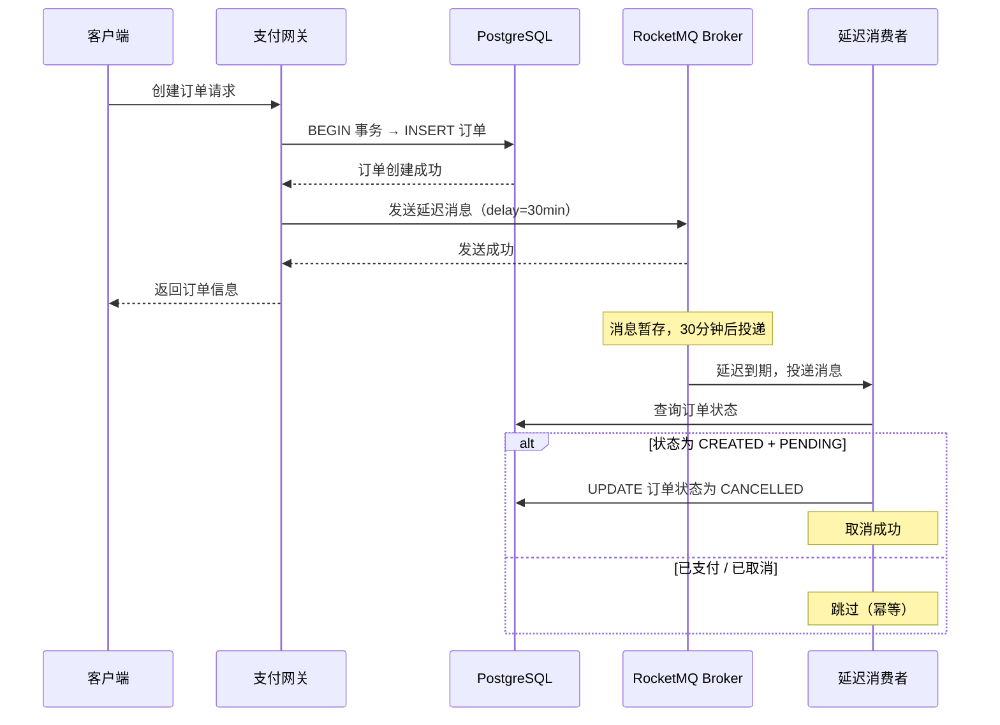
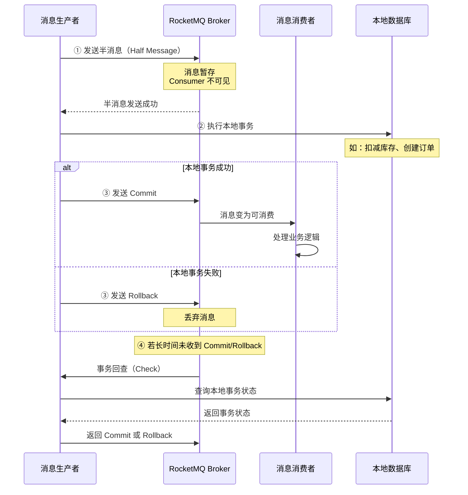
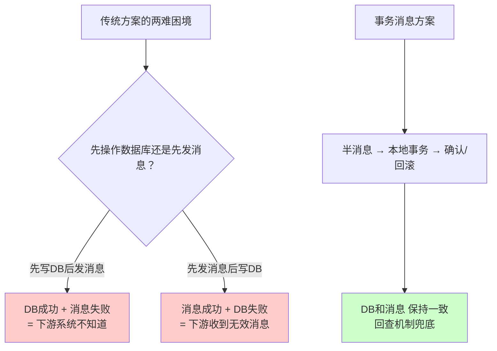
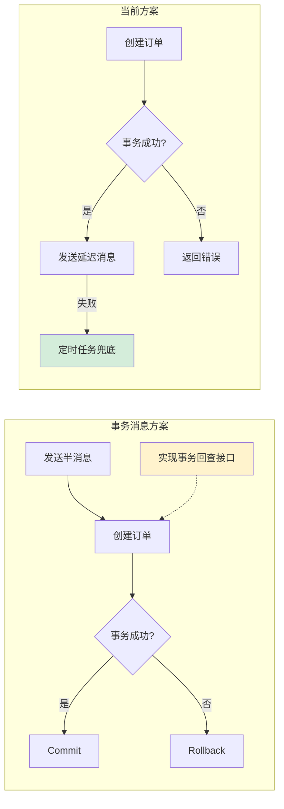
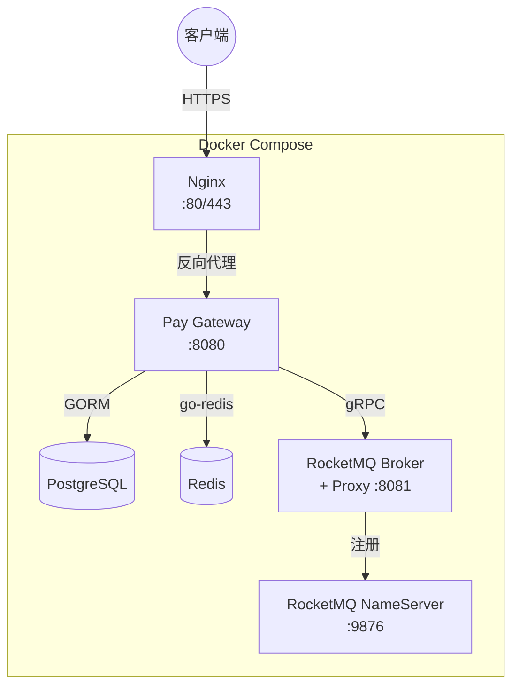

# RocketMQ 订单超时自动取消方案

本文档介绍支付网关中基于 Apache RocketMQ 延迟消息实现订单超时自动取消的方案，并深入讲解 RocketMQ 事务消息（半消息）机制及其适用场景。

## 目录

- [方案概述](#方案概述)
- [延迟消息方案](#延迟消息方案)
- [RocketMQ 事务消息（半消息）](#rocketmq-事务消息半消息)
- [为什么本项目不使用事务消息](#为什么本项目不使用事务消息)
- [场景选型对照表](#场景选型对照表)
- [配置说明](#配置说明)
- [部署架构](#部署架构)

---

## 方案概述

支付网关支持两种订单超时取消策略，二者互为兜底：

| 策略 | 触发方式 | 精度 | 依赖 |
|------|---------|------|------|
| RocketMQ 延迟消息 | 订单创建后发送延迟消息，到期后精确取消 | 秒级 | RocketMQ |
| 定时任务轮询 | 每分钟扫描过期订单批量取消 | 分钟级 | 仅数据库 |

当 RocketMQ 未启用或消息发送失败时，自动降级为定时任务轮询，保证业务可用性。

---

## 延迟消息方案

### 核心流程



### 关键设计

**1. 先写后发，定时兜底**

```
数据库事务提交 → 发送延迟消息（失败不影响订单） → 定时任务兜底
```

消息发送失败仅打 WARN 日志，不回滚订单。定时任务每分钟扫描 `expired_at < NOW()` 的待支付订单进行批量取消。

**2. 幂等消费**

消费者使用乐观条件更新，天然防重：

```sql
UPDATE orders
SET status = 'CANCELLED', refund_reason = '订单超时自动取消'
WHERE id = ? AND status = 'CREATED' AND payment_status = 'PENDING'
```

即使延迟消息与定时任务同时到达，或消息重复投递，也不会重复取消或误取消已支付订单。

**3. 接口解耦**

通过 `OrderDelayCancelSender` 接口注入各支付服务，支持测试 Mock，不耦合 RocketMQ 实现细节。

---

## RocketMQ 事务消息（半消息）

### 什么是事务消息

RocketMQ 事务消息是一种**分布式事务**解决方案，保证**本地数据库事务**和**消息发送**的原子性——要么都成功，要么都失败。

### 核心流程



### 四个阶段详解

| 阶段 | 动作 | 说明 |
|------|------|------|
| ① 发送半消息 | Producer → Broker | 消息写入 Broker 但标记为"不可消费"，Consumer 看不到 |
| ② 执行本地事务 | Producer → 本地 DB | 执行数据库操作（如创建订单、扣减库存） |
| ③ 二次确认 | Producer → Broker | 本地事务成功发 Commit（消息可消费），失败发 Rollback（丢弃消息） |
| ④ 事务回查 | Broker → Producer | 若 Broker 长时间未收到确认（网络超时等），主动回查 Producer 的事务状态 |

### 解决的核心问题

事务消息解决的是**两个系统操作的原子性**问题：



**典型场景**：电商下单扣库存

1. 半消息发送到 Broker（消费者还看不到）
2. 本地扣减库存 → 成功则 Commit，库存不足则 Rollback
3. Commit 后消费者才收到"创建订单"消息
4. 若过程中网络断开，Broker 回查库存服务确认事务状态

---

## 为什么本项目不使用事务消息

### 对比分析



### 三个不需要的理由

**1. 消息丢失不会导致业务错误**

延迟消息只是一个"到期提醒"：到时间了去检查这笔订单是否需要取消。即使消息丢了：
- 不会导致订单被错误支付
- 不会导致订单被错误取消
- 最坏情况只是取消**延迟**了几十秒（等定时任务扫到）

**2. 有定时任务作为兜底**

原有的每分钟一次 `CancelExpiredOrders` 定时扫描始终在运行。延迟消息是"精确狙击"，定时任务是"地毯式扫描"，两者互补。

**3. 消费者天然幂等**

消费者收到消息后检查订单实际状态，只取消 `CREATED + PENDING` 的订单。无论消息重复投递、延迟到达、还是定时任务已提前取消，都不会产生副作用。

### 引入事务消息的代价

| 项目 | 影响 |
|------|------|
| 实现事务回查接口 | 需提供 `CheckLocalTransaction` 回调，查询 DB 判断订单是否已创建 |
| 维护事务状态表 | 需额外记录每条半消息对应的本地事务状态 |
| 增加链路复杂度 | 半消息 → 本地事务 → 二次确认，比先写后发复杂 |
| 排查难度增加 | 事务回查、半消息超时等异常场景增多 |

**结论**：在"订单超时取消"这个最终一致性场景下，"先写后发 + 定时兜底"已经足够可靠，引入事务消息是过度设计。

---

## 场景选型对照表

| 业务场景 | 一致性要求 | 推荐方案 | 原因 |
|---------|----------|---------|------|
| 下单扣库存 | 强一致 | **事务消息** | 订单创建了但库存没扣 = 超卖 |
| 跨服务转账 | 强一致 | **事务消息** | A 扣了钱但 B 没到账 = 资金损失 |
| 订单超时取消 | 最终一致 | **延迟消息 + 定时兜底** | 消息丢了只是取消晚一点，有兜底 |
| 发送通知/短信 | 最终一致 | **普通消息 + 重试** | 丢了可以重试或兜底 |
| 数据同步/刷缓存 | 最终一致 | **普通消息** | 偶尔丢失可接受，下次查询自动修复 |
| 积分/优惠券发放 | 最终一致 | **事务消息 或 本地消息表** | 用户感知强，但可以延迟补发 |

---

## 配置说明

### 环境变量

| 变量 | 默认值 | 说明 |
|------|--------|------|
| `ROCKETMQ_ENABLED` | `false` | 是否启用 RocketMQ |
| `ROCKETMQ_ENDPOINT` | `localhost:8081` | RocketMQ Proxy gRPC 地址 |
| `ROCKETMQ_ACCESS_KEY` | 空 | 访问密钥（ACL 开启时必填） |
| `ROCKETMQ_SECRET_KEY` | 空 | 密钥（ACL 开启时必填） |
| `ROCKETMQ_ORDER_DELAY_TOPIC` | `order-timeout-cancel` | 订单超时取消 Topic |
| `ROCKETMQ_CONSUMER_GROUP` | `pay-gateway-order-cancel-cg` | 消费者组名 |
| `ROCKETMQ_ORDER_TIMEOUT` | `30m` | 订单超时时间 |

### TOML 配置

```toml
[rocketmq]
enabled = true
endpoint = "localhost:8081"
order_delay_topic = "order-timeout-cancel"
consumer_group = "pay-gateway-order-cancel-cg"
order_timeout = "30m"
```

---

## 部署架构

### Docker Compose 服务



### 启动命令

```bash
# 启动全部服务（含 RocketMQ）
docker-compose up -d

# 仅启动基础设施
docker-compose up -d postgres redis rocketmq-namesrv rocketmq-broker

# 不使用 RocketMQ（降级模式）
ROCKETMQ_ENABLED=false docker-compose up -d postgres redis pay-gateway
```

### Topic 自动创建

RocketMQ 5.x 默认开启 `autoCreateTopicEnable`，首次发送消息时会自动创建 Topic。生产环境建议手动预创建：

```bash
# 进入 Broker 容器
docker exec -it pay-gateway-rocketmq-broker bash

# 创建 Topic
sh mqadmin updateTopic -n localhost:9876 -t order-timeout-cancel -c DefaultCluster
```
